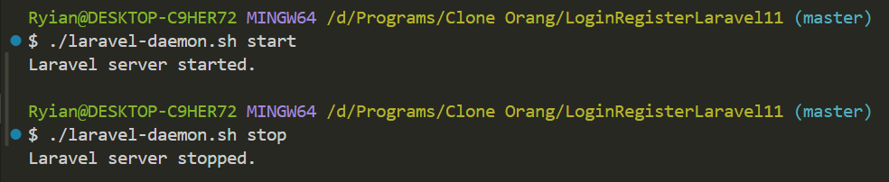

# MENJALANKAN DAEMON PROCESS DI LARAVEL

## Deskripsi
Dokumentasi ini menjelaskan cara membuat dan menggunakan skrip untuk menjalankan dan menghentikan server Laravel sebagai daemon.

## Langkah-langkah

### 1. Salin Proyek Laravel
Clone proyek Laravel yang diinginkan dari repositori lain dengan perintah:
```bash
git clone <proyek_orang_lain>
```

### 2. Membuat Skrip Daemon

#### a. Buat File Skrip
Buat file baru bernama `laravel-daemon.sh` dengan perintah:
```bash
touch laravel-daemon.sh
```

#### b. Edit File Skrip
Buka file `laravel-daemon.sh` menggunakan editor teks favorit Anda (misalnya `nano`, `vim`, atau editor lainnya).

#### c. Masukkan Skrip
Salin dan tempel skrip berikut ke dalam file:
```bash
#!/bin/bash

case "$1" in
    start)
        # Cek apakah server sudah berjalan
        if [ -f laravel.pid ]; then
            echo "Laravel server is already running."
            exit 1
        fi

        # Jalankan server dan simpan PID ke file
        nohup php artisan serve > /dev/null 2>&1 &
        echo $! > laravel.pid
        echo "Laravel server started."
        ;;
    stop)
        # Cek apakah file PID ada
        if [ -f laravel.pid ]; then
            PID=$(cat laravel.pid)
            kill $PID
            rm laravel.pid
            echo "Laravel server stopped."
        else
            echo "No Laravel server is running."
        fi
        ;;
    *)
        echo "Usage: $0 {start|stop}"
        exit 1
        ;;
esac
```

#### d. Berikan Izin Eksekusi
Jalankan perintah berikut untuk memberikan izin eksekusi pada skrip:
```bash
chmod +x laravel-daemon.sh
```

### 3. Menjalankan dan Menghentikan Server

#### a. Untuk Memulai Server
Jalankan server dengan perintah:
```bash
./laravel-daemon.sh start
```
**Pesan yang muncul:** 
```
Laravel server started.
```

#### b. Untuk Menghentikan Server
Hentikan server dengan perintah:
```bash
./laravel-daemon.sh stop
```
**Pesan yang muncul:**
```
Laravel server stopped.
```

### 4. Mengakses Aplikasi Laravel
Setelah server berjalan, buka browser dan masukkan URL:
```
http://localhost:8000
```
### 5. Screenshot

